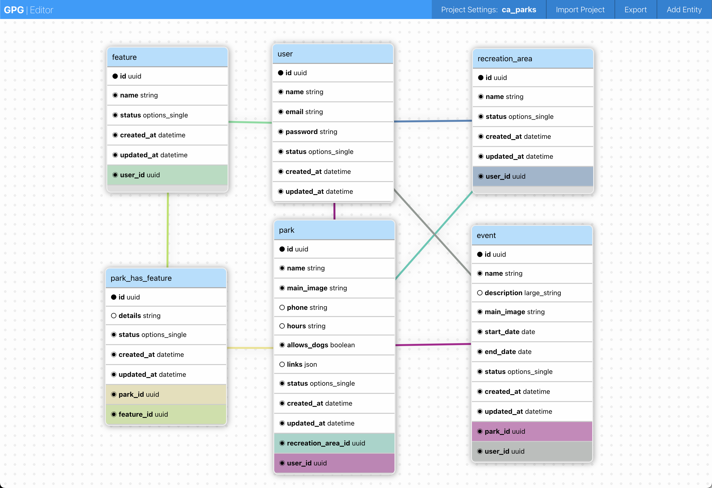
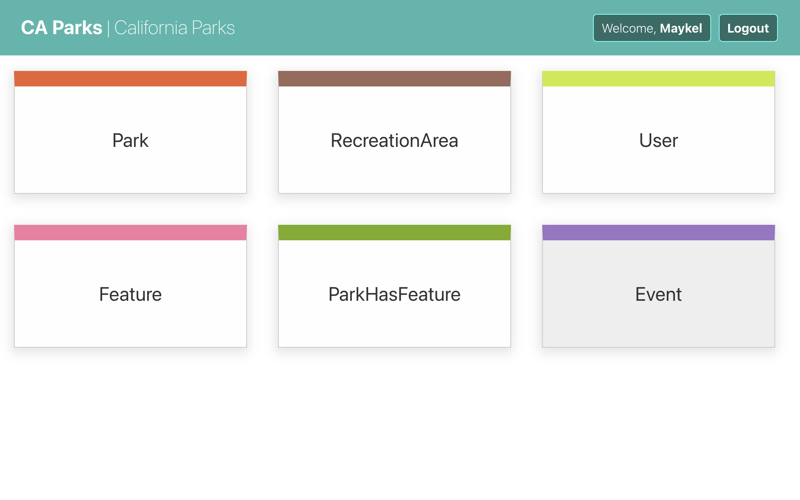
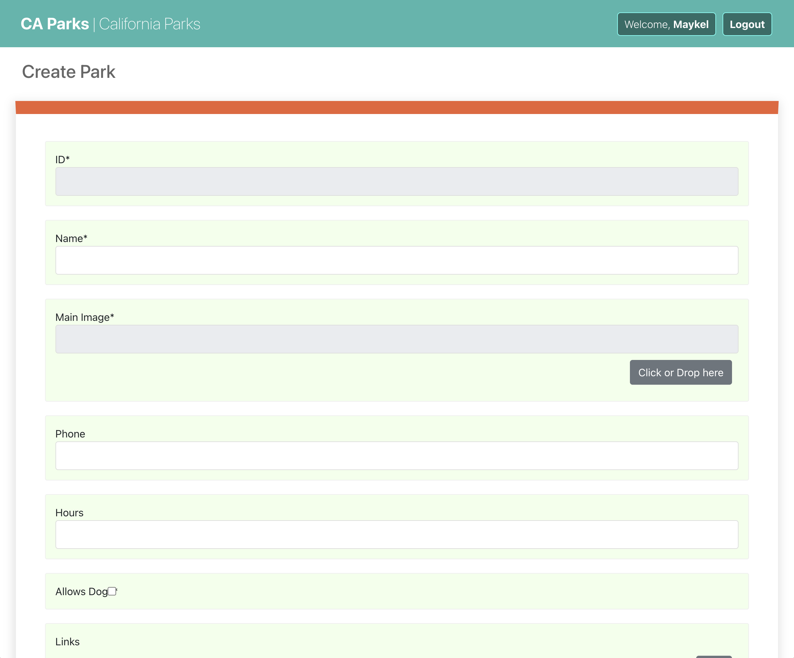

# GPG Demo: CA Parks 

This code was generated using [GPG](https://github.com/mklfarha/gpg)(Go Project Generator).

To learn more about GPG and how to use it check out the [readme](https://github.com/mklfarha/gpg/blob/master/README.md).

## CA Parks Design



This project has 6 entity definitions:
- User 
- Park 
- Feature
- Park Has Feature (relationships are treated as entities)
- Recreation Area
- Event 

The modeling was done in the [GPG Config Editor](https://gpg.maykelfarha.com/)

GPG will generate a GraphQL API and a web CMS to manage the data:




## How to run 

To run the API: 

```
cd ./api

go run . 
```

By default, it will run at port 8080

To run the web app:

```
cd ./web

npm install

npm start
```

A lot more details can be found in the GPG [readme](https://github.com/mklfarha/gpg/blob/master/README.md).
